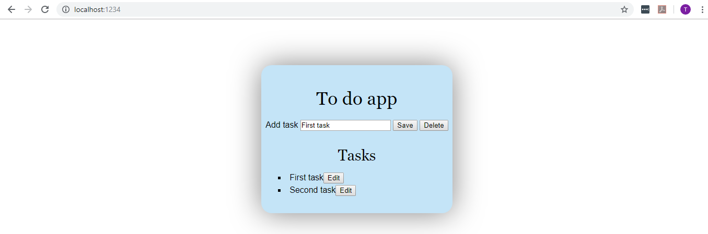

# To do

It's a small To_do application

#### Starting the app

1. Type in the **...academy\To_do\database> json-server --watch database.json**  to initiate the database;

2. Type in the **...academy\To_do>npm start** to start the app;

#### Technologies used

#####For the front-end;

- JavaScript;
- HTML;
- CSS;
	- Parcel
	- Axios

#####For the databse

-JSON server

####Purpose of the app

1. Executing CRUD operations with http requests;