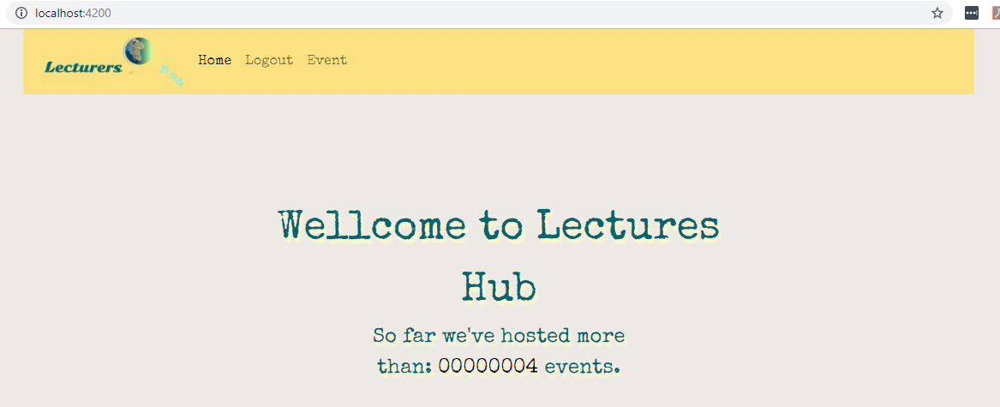

#Audience interaction app - Final Angular 8 project

Small app where you can send and receive live questions while someone is giving an online lecture.

####Start the app

1. Type in dir **...audience_interaction\src> npm start** in order to start the back-end;

2. Type in **...academy\audience_interaction\audience-interaction> ng serve** in order to start the front-end;
#### Technologies used

##### For the back-end

- JavaScript;

	- ExpressJS;
	- Mongoose;
	- Jsonwebtoken;
	- Crypto;
	- Body-parser;

#####For the front-end;

- Angular 8
- JavaScript (TypeScript);
- HTML;
- CSS;

	- Axios;
	- Bootstrap;